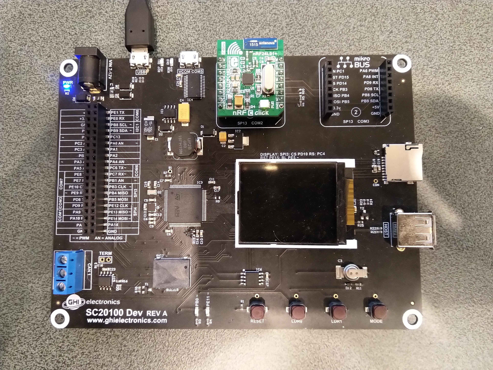
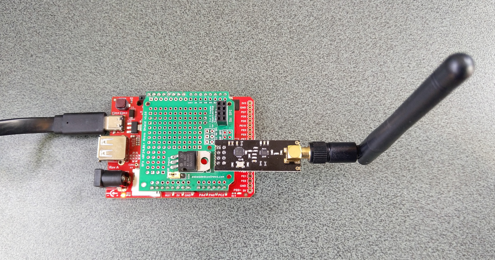
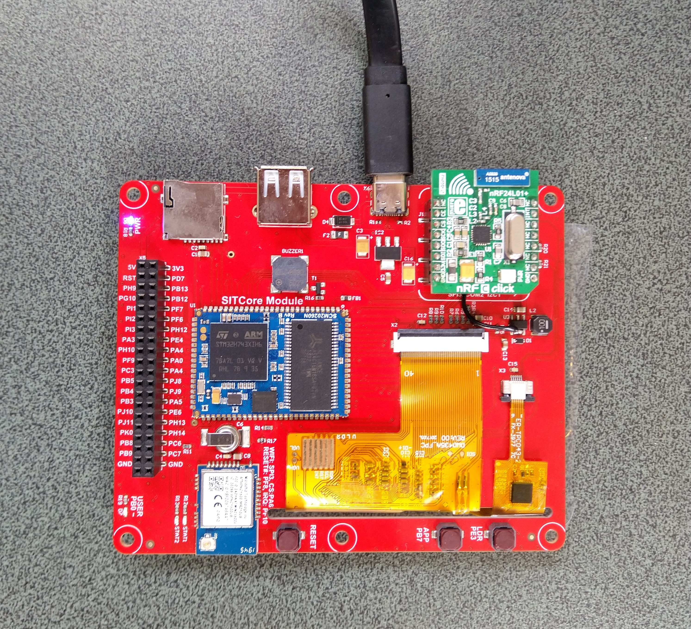

# nRF24L01-TinyCLR
C# Nordic Semiconductor [nRF24L01](https://www.nordicsemi.com/Products/Low-power-short-range-wireless/nRF24-series) library for
[GHI Electronics](https://www.ghielectronics.com/) [TinyCLR](https://www.ghielectronics.com/tinyclr/) devices.

This repo has the source code for the series of blog posts written as I ported [techfooninja/Radios.RF24](https://github.com/techfooninja/Radios.RF24) to TinyCLR V2

01. [DeviceSPI](https://blog.devmobile.co.nz/2020/05/13/tinyclr-os-v2-nrf24l01-library-part1/)
02. [Porting](https://blog.devmobile.co.nz/2020/05/14/tinyclr-os-v2-nrf24l01-library-part2/)

[Sample client](https://blog.devmobile.co.nz/) for my Windows 10 IoT Core Field Gateways.
